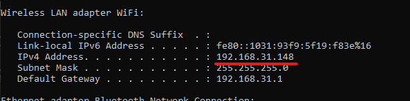
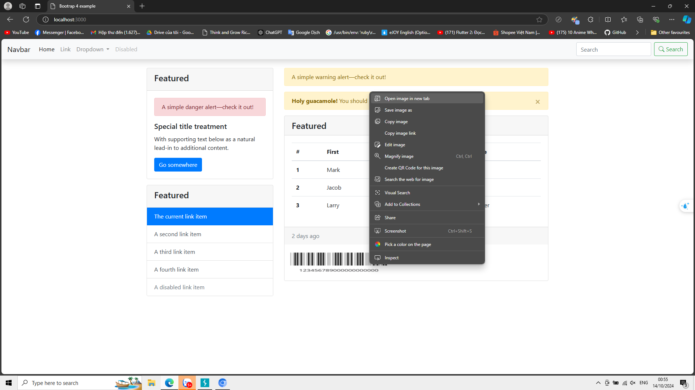
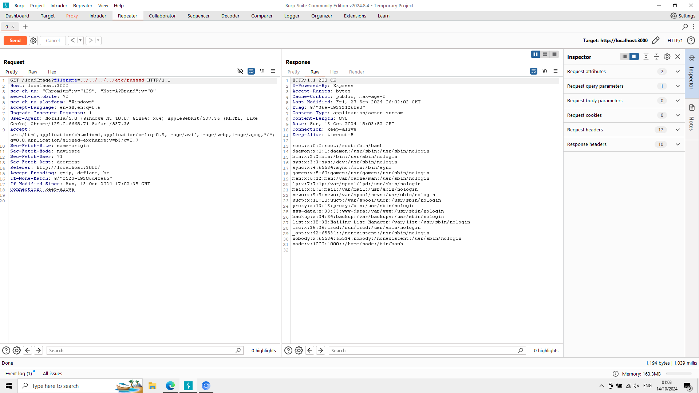

# Directory traversal

### **Yêu cầu cài đặt:**
- Nodejs
- Docker desktop

### Công cụ hỗ trợ:
- Burp suite comminity

Tạo folder chứa, sau đó clone repository
> git clone https://github.com/nhhpbc7a1/INSE_directory-traversal_labs

Vào folder folder vừa clone được, docker compose
> docker-compose up --build

Địa chỉ host website:
> https://localhost:3000

Địa chỉ để truy cập website trong mạng nội bộ là địa chỉ ip của máy host, thêm cổng 3000 ngoài sau

Cách xem địa chỉ ip đối với windows
> ipconfig 

vậy địa để website trong mạng nội bộ là
> https://192.168.31.148:3000

Mở burp suite và bật intercept

Mở browser của burp suite và truy cập website

Các request hiện ra

Send to repeater, để chỉnh sửa request đó

Qua repeater, bắt đầu chỉnh sửa

## Case 1:

=> Truy cập thành công file /etc/passwd của server website

video tham khảo:
> https://www.youtube.com/watch?v=6z49dU1HVgI&list=PLuyTk2_mYISL2DdD_m1ELEjpiPKxV98MO
> https://portswigger.net/web-security/file-path-traversal

video đã đầy đủ các bước thao tác, đây mà môi trường mẫu để có thể thử nghiệm phòng thủ các lỗ hổng của các lab.